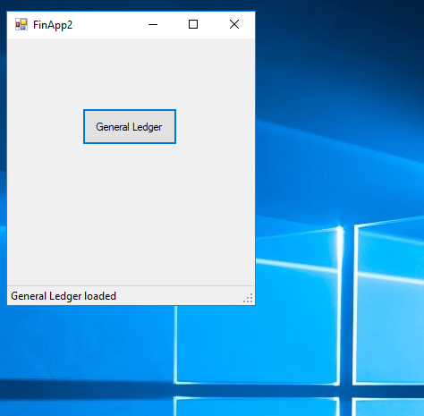

# FinApp use case

FinApp is a .net desktop application for Windows that was crashing. The code could not be changed easily. A quick fix was found (related to folder permissions) and deployed using Aternity Auto-Remediation with Alert.

A sample of the application, called FinApp2, reproduces the crash issue. It is provided here with a simple install procedure, as well as the fix, the Remediation script and other details to use with Remediation and Auto-Remediation in Aternity.


## Test FinApp2 and fix using Auto-Remediation

### Preparation

1. [Install the application](#Install-FinApp2) on a test device and [test the crash scenario](#Test-the-crash-scenario)

2. Follow the [preparation and signing instructions in the FAQ](../../Readme.md) to sign the [remediation script for FinApp2](./Remediation-FinApp2-Permissions.ps1) and import the Signing Certificate on the test machine.

3. Create a remediation Action in Aternity and upload the signed script with the following settings:
    - Enable system permissions (required by this fix)
    - Disable the end-user message to make the Remediation run silently without user validation.

### Run Remediation and revert the fix for testing

1. Run the Remediation action on the test device. For example: search for the test device, open the Device Events dashboard, run the remediation and wait until it has run successfully

2. Test the crash scenario on the test device and validate the application is now fixed.

3. [Revert](####Revert-the-fix) the fix on the test device, so that the test scenario will crash as initially

### Use Auto-Remediation with an Alert rule

1. Create an Alert rule in Aternity setting the remediation created previously in the Actions and wait few minutes
    - Name: FinApp2
    - Event Type: Application Crash (Dotnet)
    - Filter By Event Identifier: FinApp2.exe
    - Actions: select the remediation

2. Test the crash scenario on the test device. The Auto-Remediation will be executed few minutes after. You can monitor from the Device Events dashboard

3. Test the crash scenario again and validate the app is fixed on the test device

## FinApp2 details

### Install FinApp2

To install FinApp2, you need to download the files in a folder and run the install script with Administrator privileges:

```powershell
# Launch Windows Powershell (Admin)
cd my folder
.\Install.ps1
```

The application will be installed in C:\Program Files\FinApp2:


### Test the crash scenario

As a normal user (not admin), open a windows session on the machine
Go to  C:\Program Files\FinApp2 and launch the app.


Click on the button "General Ledger". The application will crash (if the folder permission issue is not fixed)


To fix or revert the fix, simply run the following scripts with Administrator privileges. The fix is also provided as a [Remediation script](./Remediation-FinApp2-Permissions.ps1) for Aternity.



#### Fix

```powershell
# Launch Windows Powershell (Admin)
cd my-folder
.\resources\Fix.ps1
```

#### Revert the fix

```powershell
# Launch Windows Powershell (Admin)
cd my-folder
.\resources\Revert.ps1
```
